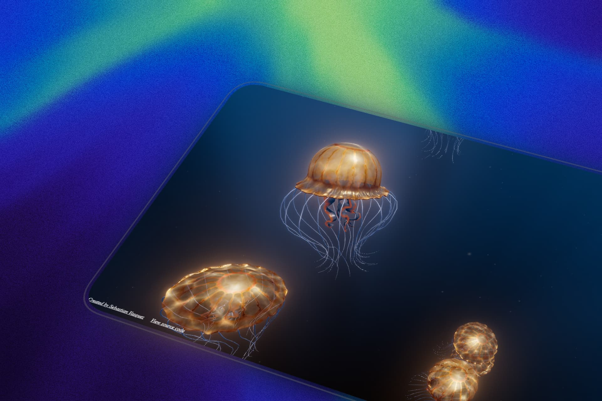

<div align="center">

#🌊✨ Aurelia

*Real-time procedural jellyfish swimming through an ocean of code, powered by WebGPU.*

[](https://threejs.org/)
[](https://www.w3.org/TR/webgpu/)
[](https://vitejs.dev/)
[](https://developer.mozilla.org/en-US/docs/Web/JavaScript)
[](https://www.khronos.org/webgl/)
[](https://www.khronos.org/opengl/)

</div>


[](https://jellyfish-sage.vercel.app/)

<div align="center">

**[→ Watch Aurelia swim live ←](https://jellyfish-sage.vercel.app/)**

</div>

---

There's something about jellyfish that makes you stop and watch. They don't swim like other creatures. They pulse. They drift. They become the water itself.

I've been chasing that feeling for years. One year ago, I built my first jellyfish simulation in Flash. The web was a different place then—no touch screens, no GPU compute, just raw creativity squeezed into a dying plugin. The project was called Aurelia, after *Aurelia aurita*, the moon jellyfish. It was beautiful in its own way. But it was trapped in the past.

So I rebuilt it. From scratch. For the modern web.

**Aurelia** is what happens when you combine procedural generation, GPU-accelerated physics, and a deep love for these creatures. Everything you see—the bells, the tentacles, the god rays, the floating plankton—is generated in real-time. No textures. No 3D models. Just math, noise, and shaders.

And here's what makes it special: it's not a demo. It's an ecosystem. Ten jellyfish, each with their own rhythm, swimming through a world that feels alive.

Ready to see what's inside? Let's dive in.

---

## Table of Contents

- [The Journey](#the-journey)
- [Features](#features)
- [Technologies](#technologies)
- [Project Structure](#project-structure)
- [Installation](#installation)
- [How to Use](#how-to-use)
- [How It Works](#how-it-works)
- [Behind the Scenes](#behind-the-scenes)
- [Performance](#performance)
- [What's Next](#whats-next)
- [Credits](#credits)
- [License](#license)

---

## The Journey

When you open Aurelia, the screen stays dark for a moment. Then... movement. Slow, deliberate, alive. Ten translucent bells emerge from the void, each breathing with its own quiet rhythm.

They pulse upward, trailing gossamer tentacles that sway with invisible currents. God rays stream from above. Plankton drifts past your eyes. The background shifts like a deep ocean abyss.

It's the kind of thing that makes you forget you're looking at a browser.

Move your mouse near a jellyfish and something happens—it reacts. It glows brighter, as if charging with energy. The closer you get, the more it responds. It's a small interaction, but it changes the entire experience. Suddenly, this isn't just a visualization. It's a conversation.

And the deeper you look, the more you notice. Each jellyfish moves differently. The bell patterns are unique. The tentacles respond to physics you can't see but can definitely feel. It's the kind of project that makes you think... *how did they do this?*

---

## Features

**GPU-Accelerated Verlet Physics**
Hundreds of particles connected by springs, simulated at 360 steps per second entirely on the GPU. The tentacles and oral arms aren't animated—they're simulated.

**Procedural Everything**
No textures. No 3D models. The bell geometry, color patterns, background fog, god rays, and plankton are all generated in shaders. The entire visual appearance is computed from math and noise.

**Interactive Charge System**
Mouse proximity "charges" jellyfish, increasing their swim speed, glow intensity, and bloom response. It creates a tangible connection between the viewer and the simulation.

**MRT Post-Processing**
A custom Multiple Render Targets pipeline separates bloom intensity from the main output, allowing selective glow on emissive areas and charge-responsive color masking.

**Dynamic Plankton System**
Over a thousand billboarded particles that adapt their count based on camera view volume. Positioned with hash functions, drifted by 3D noise, and fogged by distance.

**Biomechanical Bell Simulation**
The bell shape uses a mathematical formula combining sinusoidal pulsation, azimuthal riffles, and noise-based surface bumps. It breathes. It contracts. It feels organic.

**Dual-Sided Rendering**
The bell has separate inside and outside materials with different opacity, environment reflection, and Fresnel-like edge glow. This creates the translucent, bioluminescent look.

---

## Technologies

| Technology | Why It Matters |
|:-----------|:---------------|
| **Three.js** | The rendering engine. Provides the scene graph, materials, and WebGPU integration that makes everything possible. |
| **WebGPU** | The future of web graphics. Enables compute shaders for physics simulation and the full rendering pipeline. |
| **Vite** | Lightning-fast development experience. Hot module replacement keeps the feedback loop tight. |
| **GLSL / TSL** | Three Shading Language powers every material. Node-based shaders compute geometry, lighting, and post-processing on the GPU. |
| **Simplex Noise** | The secret ingredient behind organic movement. Drives jellyfish drift, surface perturbations, and environmental effects. |
| **Tweakpane** | Debug GUI for real-time parameter tweaking. Adjust roughness, metalness, iridescence, and simulation toggles on the fly. |

---

## Project Structure

```
aurelia/
├── index.html              # Entry point with loading screen
├── index.js                # Bootstrap: WebGPU check, renderer init, animation loop
├── vite.config.js          # Vite config with TSL operator plugin
│
└── src/
    ├── app.js                 # Main orchestrator — camera, controls, physics, bloom
    ├── conf.js                # Runtime configuration & Tweakpane GUI
    │
    ├── medusa.js              # The jellyfish entity: movement, charge, lifecycle
    ├── medusaBell.js          # Bell assembly: top, bottom, margin, geometry
    ├── medusaBellGeometry.js  # Procedural mesh with TSL shader materials
    ├── medusaBellFormula.js   # The math behind the bell shape
    ├── medusaBellPattern.js   # Color and emissive patterns
    ├── medusaBellMargin.js    # Bell rim with Verlet physics & muscle vertices
    ├── medusaBellTop.js       # Upper hemisphere from icosahedron subdivision
    ├── medusaBellBottom.js    # Lower hemisphere with inward-facing normals
    ├── medusaOralArms.js      # 4 frilly arms as cloth-simulated grids
    ├── medusaTentacles.js     # 20 tentacles with 20-link spring chains
    ├── medusaVerletBridge.js  # GPU bridge between formula and physics
    │
    ├── background.js          # Procedural underwater fog & water caustics
    ├── godrays.js             # Volumetric light from each jellyfish
    ├── lights.js              # Directional + hemisphere lighting
    ├── plankton.js            # Instanced billboarded particle system
    │
    ├── common/
    │   └── noise.js           # Simplex noise wrapper
    │
    └── physics/
        ├── verletPhysics.js   # GPU compute shader physics engine
        ├── springVisualizer.js
        └── vertexVisualizer.js
```

---

## Installation

```bash
git clone https://github.com/sebastianvasquezechavarria1234/jellyfish-three.js.git
cd jellyfish-three.js
npm install
npm run dev
```

The dev server starts on port 1234. Open your browser and navigate to `http://localhost:1234`.

WebGPU is required for the full experience. Chrome 113+ or Edge 113+ work best.

---

## How to Use

**Controls**

- Click and drag to orbit around the jellyfish
- Scroll to zoom in and out
- Hover near a jellyfish to push it away with an invisible force

**What You'll See**

Ten jellyfish swim upward through a deep blue void. Each one has a pulsing bell, twenty trailing tentacles, four flowing oral arms, and a unique movement pattern driven by noise.

Move your mouse near one and watch it react. The closer you get, the brighter it glows. It's a small touch, but it makes the whole scene feel alive.

**Debug Controls**

The Tweakpane panel in the corner lets you adjust material properties in real-time—roughness, metalness, iridescence, transmission. You can also toggle the physics simulation and visualize the Verlet springs.

---

## How It Works

This is where it gets interesting.

### The Bell Formula

The bell shape isn't a static mesh. It's a mathematical function. Every vertex is computed from zenith and azimuth angles, driven by a phase parameter that creates the pulsation. Sinusoidal riffles add the characteristic folds. Noise perturbations make it feel organic.

The formula lives in `medusaBellFormula.js` and is evaluated both on the CPU (for physics) and on the GPU (for rendering).

### GPU Physics Engine

The Verlet simulation runs entirely on the GPU using WebGPU compute shaders. Three compute passes happen every frame:

1. Initialize spring rest lengths from initial positions
2. Compute spring forces between connected vertices
3. Aggregate forces and update vertex positions

At 360 steps per second, the simulation is stable enough for stiff springs and fast movement.

### The Bridge

Here's the clever part. The `MedusaVerletBridge` runs a GPU compute shader that maps every Verlet vertex back to its correct position on the animated bell surface each frame. This means tentacles and oral arms follow the pulsating bell without any CPU intervention.

It's the glue between the mathematical formula and the physics simulation.

### Post-Processing

The bloom effect uses Multiple Render Targets to separate glow intensity from the main output. A custom pass combines them with charge-responsive color masking—jellyfish that are "charged" by mouse proximity shift toward a blue-white glow.

### Procedural Environment

The underwater background is ray-marched noise. The environment reflections use a procedural water caustic pattern. God rays project from each jellyfish along the light direction. Plankton particles adapt their count to the visible volume.

Everything is computed. Nothing is stored.

---

## Behind the Scenes

A few details that developers might find interesting.

**Shared Uniforms Pattern**
All ten jellyfish share the same material. Per-render callbacks set individual transforms, phases, and charge values through static uniforms. This keeps draw calls efficient while maintaining visual variety.

**Icosahedron Subdivision**
The bell geometry starts as an icosahedron and subdivides into a zenith/azimuth grid. This gives the 5-fold symmetry characteristic of real jellyfish, with 40 subdivisions for smooth surfaces.

**Hybrid Vertex Displacement**
Some bell vertices are displaced purely by the shader formula. Others read their positions from GPU storage buffers populated by the physics engine. The `vertexIds` attribute tells each vertex which path to take.

**Dynamic Plankton Count**
The plankton system scales its instance count based on camera view bounds. Zoom out and more particles appear. Zoom in and they thin out. The math is simple: volume times a density factor.

**No Traditional Textures**
The bell patterns—lines, speckles, fade zones—are computed in the fragment shader using UV coordinates and noise functions. The color mixing between white, orange, and red happens per-pixel.

---

## Performance

The project is built for smooth performance:

- **GPU Compute**: Physics simulation runs entirely on the GPU, not the CPU
- **Instanced Rendering**: Plankton and tentacles use instanced draw calls
- **Frustum Culling**: Off-screen objects aren't rendered
- **Adaptive LOD**: Plankton count scales with visible volume
- **Efficient Shaders**: Minimal branching, optimized math, precomputed values

| Browser | WebGPU | WebGL Fallback |
|:--------|:------:|:--------------:|
| Chrome 113+ | Yes | Yes |
| Edge 113+ | Yes | Yes |
| Firefox | No | Yes |
| Safari 18+ | Yes | Yes |

---

## What's Next

There are a few directions this could go:

- Touch controls for mobile interaction
- More jellyfish species with different behaviors
- Ambient underwater audio
- Simulated water currents
- Web Audio API integration to react to music
- VR support for diving into the scene

But honestly? What's here already feels complete. The rest is just exploration.

---

## Credits

**Libraries**

- [Three.js](https://threejs.org/) — The rendering engine that makes it all possible
- [Vite](https://vitejs.dev/) — Fast, modern build tool
- [Tweakpane](https://tweakpane.github.io/docs/) — Elegant debug interface
- [Simplex Noise](https://www.npmjs.com/package/simplex-noise) — Organic procedural movement

**Inspirations**

- [Chrysaora](https://akirodic.com/p/jellyfish/) by Aki Rodic — A masterclass in WebGL jellyfish
- [Particulate Medusae](https://github.com/milcktoast/particulate-medusae) by Ash Weeks — Beautiful particle-based approach
- [Luminescence](https://www.shadertoy.com/view/4sXBRn) by BigWings — Stunning shader work

**The Original**

This is a reimagination of [Aurelia](https://holtsetio.com/old/aurelia/)—a Flash game from 2011, rebuilt for the modern web with GPU compute and procedural generation.

---


<div align="center">
Made with ❤️ by <a href="https://sebas-dev.vercel.app/" target="_blank" rel="noopener noreferrer">Sebastián V</a>
</div>